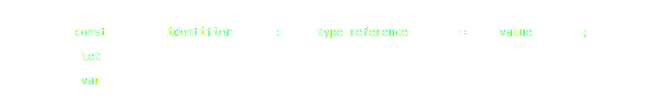

# TypeScript 101

a **very** lightweight introduction

# Topics

- Static Typing
- Typescript
- Types
- Operators
- Generics
- Type Narrowing
- Advanced Features
- Tooling
- Errors
- Common Mistakes

# Non Topics

- Project Setup
- Compiler Configuration
- Debugging

# Static Typing

## What is this?

A way to tell how the data looks like at compile time.

Example with Java:

```java
String name = "John Doe";
```

## Why is this important?

- allows static analysis and type safety verification
- minimizes the possibility of type errors in run time
- improves instant feedback while developing
- improves IDE capabilities
  - no more find/replace to refactor

Note:

- does not require to run the program

## Static Typings in Other Languages

- it is what it is
  - typescript is highly configurable
- either mandatory or non existent
  - optional in typescript but highly recommended, that's why we are here

Note:

- considering only the more mainstream languages

# Typescript

## What is TypeScript

- A programming language, pretty obvious here
- Superset of JS
- Second "most loved" programming language in 2020
- Maintained by Microsoft

Note:

- any JavaScript code is also TypeScript code

## What is not?

- A magical way of fixing all of our problems
- Executed at runtime
- A passing trend
- A replacement for unit tests

## Transpiler? Errr... What?

- compiler
  - transforms one language into another
    - usualy machine code
- transpiler
  - a type of compiler
  - produces human readable source code

Note:

- the TypeScript compiler produces human readable JavaScript that can be further processed and optimized

## Type Inference

- explicit typing
  - the source code describes the types
- implicit typing
  - the compiler infers types from the existing source code

## Type Compatibility

Type compatibility in TypeScript is based on structural typing.

```typescript
interface Pet {
  name: string;
}
class Dog {
  name: string;
}
let pet: Pet;
// OK, because of structural typing
pet = new Dog();
```

this is also called duck typing 🦆

> if it walks like a duck and it quacks like a duck, then it must be a duck

Note:

- in contrast with nominal typing, like C or Java

## Pros / Cons

Pros:

- can be adopted gradually
- any JavaScript code is also TypeScript code
- rich IDE support
- awesome support for TSX (JSX + TypeScript)
- can make tests easier to write

Cons:

- adds an extra effort to the development process
- typings can get pretty complex
- third-party typings are not always up to date

# Types

`let variable: Type = value;`



Note:

```bnf
Diagram(
  Optional(
    Choice(0,
      Terminal('const'),
      Terminal('let'),
      Terminal('var'),
    ),
  ),
  NonTerminal('identifier'),
  Optional(
    Sequence(
      Terminal(':'),
      NonTerminal('type reference')
    )
  ),
  Optional(
    Sequence(
      Terminal('='),
      NonTerminal('value')
    )
  ),
  Optional(
    Terminal(';')
  ),
)
```

## primitive types

```typescript
const y: number = 42;
```

```typescript
const name: string = "foobar";
```

```typescript
const isSomething: boolean = true;
```

Note:

- using type annotations together with the initialization is redundant and unnecessary
  - the compiler can infer the type

## primitive types

```typescript
const x = 27;
```

```typescript
const name = "foo";
```

```typescript
const isSomething = true;
```

## arrays

```typescript
const words: string[] = ["Foo", "Bar"];
```

```typescript
const words: Array<string> = ["Foo", "Bar"];
```

## tuples

```typescript
const tuple: [string, number] = ["FooBar", 27];
```

## functions

```typescript
function formatPrice(fn: (v: number) => string): string {}
```

## objects

```typescript
function printName(obj: { first: string; last?: string }) {
  // ...
}
```

```typescript
printName({ first: "John", last: "Doe" });
printName({ first: "Bob" });
```

## any

its like saying

> please turn off type checking for this thing

Note:

- it allows everything that’s syntactically legal
- please don’t use it

## unknown

similar to the any type, but is safer because it’s not legal to do anything with an unknown value

```typescript
let maybe: unknown;
```

requires type guards to access the value

```typescript
if (typeof maybe === "string") {
  // maybe is a string
}
```

## void

used for functions returning `void`

```typescript
function noop(): void {}
```

```typescript
function noop() {}
```

```typescript
function noop() {
  return;
}
```

## never

some functions `never` return a value

```typescript
function fail(msg: string): never {
  throw new Error(msg);
}
```

## type arithmetics

a way to build new types from existing ones using operators

- unions
- intersections

### union types

```typescript
function draw(shape: Square | Circle) {}
```

### intersection types

```typescript
function draw(shape: Shape & Colorful) {}
```

## type aliases

a way to define a new type to be used in other places

```typescript
type Person = {
  name: string;
  age: number;
  height?: number;
};
```

```typescript
type Shape = Square | Circle;
```

## interfaces

```typescript
interface Person {
  name: string;
  age: number;
  height?: number;
}
```

## type aliases vs interfaces

- declaration merging
  - type aliases cannot be re-opened to add new properties
  - an interface is always extendable
- functionality
  - interfaces can only describe the structure of objects and functions
  - type aliases can also rename primitives
- interfaces can be used as contracts
- interfaces can not describe union types

### what should I use?

The recommended way to define a type is to use `interface`, at least until you need to use features from `type`.

## literal types

```typescript
type Alignment = "left" | "center" | "right";
```

## Enums

```typescript
enum Direction {
  Left,
  Right,
} // Left === 0, Right === 1
```

```typescript
enum Direction {
  Left = "LEFT",
  Right = "RIGHT",
}
```

Note:

- since this is not supported in JavaScript, the compiler adds some runtime code

## type assertions

```typescript
let strLength: number = (someValue as string).length;
```

```typescript
let strLength: number = (<string>someValue).length;
```

its like saying

> trust me, I know what I’m doing

Note:

- Similar to a cast in other languages

## classes

```typescript
class Person {
  name: string;
  age: number;
  constructor(name: string, age: number) {
    this.name = name;
    this.age = age;
  }
}
```

### field modifiers

`readonly`

```typescript
class Person {
  readonly name: string;
}
```

`?` (optional)

```typescript
class Person {
  name: string;
  age?: number;
}
```

### member visibility

`public` | `private` | `protected`

```typescript
class Person {
  public title: string;
  protected name: string;
  private age: number;

  constructor(name: string, age: number, title: string) {
    this.name = name;
    this.age = age;
    this.title = title;
  }

  public getFullName(): string {}
}
```

### static members

```typescript
class Person {
  static getFullName(person: Person): string {
    return person.name + " " + person.title;
  }
}

Person.getFullName({ name: "John", title: "Mr." });
```

### class heritage

```typescript
abstract class Person extends Being implements Serializable {
  static species = "Homo sapiens";
  name: string;

  constructor(name: string) {
    super(Person.species);
  }

  serialize(): string {
    return JSON.stringify(this);
  }
}
```

# Operators

(for manipulating types)

Note:

- the following operators are just a subset of the ones supported by TypeScript

## keyof

```typescript
type Point = { x: number; y: number };
type P = keyof Point; // P = "x" | "y"
```

## typeof

```typescript
type Point = { x: number; y: number };
let p: Point = { x: 1, y: 2 };
let cType: typeof p.x; // cType = number
```

## indexed access type

```typescript
type Person = { age: number; name: string; alive: boolean };
type Age = Person["age"]; // Age = number
```

# Generics

a way describe meaningful type dependencies

- Class instance members
- Class methods
- function arguments
- function return value

Note:

- this allows us to write code that is type safe and reusable

## Generic Functions

```typescript
function firstElement<Type>(arr: Type[]): Type {
  return arr[0];
}
```

```typescript
function firstElement<T>(arr: T[]): T {
  return arr[0];
}
```

```typescript
const s = firstElement(["a", "b", "c"]); // s is a string

const n = firstElement([1, 2, 3]); // n is a number
```

## Generic Classes

```typescript
class Box<C> {
  contents: C[] = [];

  add(content: C) {
    this.contents.push(content);
  }

  getLast(): C | undefined {
    return this.contents.pop();
  }
}
```

## Type Parameters with Constraints

```typescript
function getProperty<Type, Key extends keyof Type>(obj: Type, key: Key) {
  return obj[key];
}

let x = { a: 1, b: 2, c: 3, d: 4 };

getProperty(x, "a");
getProperty(x, "m"); // not allowed
```

# Type Narrowing

inferring the type of a variable by narrowing down the amount of types it can be

```typescript
let someValue: number | string | undefined;
```

this is done with type guards

## typeof

```typescript
if (typeof someValue === "string") {
  // do something with the string
}
```

## truthiness

```typescript
if (someValue) {
  // do something
}
```

## equality

```typescript
function example(x: string | number, y: string | boolean) {
  if (x === y) {
    // We can now call any 'string' method on 'x' or 'y'.
  }
}
```

## in

```typescript
type Fish = { swim: () => void };
type Bird = { fly: () => void };

function move(animal: Fish | Bird) {
  if ("swim" in animal) {
    return animal.swim();
  }

  return animal.fly();
}
```

## instanceof

```typescript
function logValue(x: Date | string) {
  if (x instanceof Date) {
    console.log(x.toUTCString());
  } else {
    console.log(x.toUpperCase());
  }
}
```

## assignment

```typescript
let x: number | string = "foo";
x = "bar";
// x is now a string
x = 1;
// x is now a number
```

## type predicates

```typescript
function isFish(pet: Fish | Bird): pet is Fish {
  return (pet as Fish).swim !== undefined;
}
```

```typescript
const pet = getSmallPet();

if (isFish(pet)) {
  pet.swim();
} else {
  pet.fly();
}
```

## discriminated unions

```typescript
interface Circle {
  kind: "circle";
  radius: number;
}

interface Square {
  kind: "square";
  sideLength: number;
}

type Shape = Circle | Square;
```

```typescript
function getArea(shape: Shape) {
  switch (shape.kind) {
    case "circle":
      return Math.PI * shape.radius * shape.radius;
    case "square":
      return shape.sideLength * shape.sideLength;
  }
}
```

# Advanced Features

(just a sneak peek)

## Function Overloading

```typescript
function connect(dest: Destination): Connection;
function connect(host: string, port: number): Connection;
function connect(
  destOrHost: string | Destination, // any type of the above
  port?: number // optional
): Connection {
  if (typeof destOrHost === "string") {
    // do something with host and port
  } else {
    // do something with a destination
  }
}
```

```typescript
const c1 = connect("localhost", 80);
const c2 = connect({ host: "localhost", port: 80 });
```

Note:

- the order of the overloads should be from the most specific to the least specific

## Types for Third-Party Libraries

allows TypeScript compiler to validate calls to external code

get existing types

```sh
npm install --save @types/some-lib
```

implement your own

```typescript
declare namespace 'some-lib' {
  function makeSomething(s: string): string;
  let numberOfThings: number;
}
```

Note:

- most libraries have typings available in the npm registry

## Decorators

- a way to add
  - annotations
  - meta-programming syntax for class declarations and members

```typescript
@sealed
class Test {
  @format("yyyy-MM-dd")
  date: string;

  @measure
  @memoize
  computeX(@required arg: string) {}
}
```

Note:

- decorators can be composed
- decorator factories can receive parameters (`format`)
- decorators can be attached to
  - class declaration
  - class members: fields, methods, accessors
  - method parameters

## Mixins

A mixin is a function that

1. takes a constructor,
2. creates a class that extends that constructor with new functionality
3. returns the new class

```typescript
function Timestamped<T extends Constructor>(Base: T) {
  return class extends Base {
    timestamp = Date.now();
  };
}
```

```typescript
const TimestampedPerson = Timestamped(Person);
const tp = new TimestampedPerson();
```

Note:

- since both TypeScript and JavaScript do not support multiple inheritance, mixins can be used to implement a kind of multiple inheritance

## Transformers

a way to transform code programatically

```typescript
const Transformer = (code) => code;
```

⚠️ Here be dragons... And ASTs.

# Tooling

## TSC

TSC is the TypeScript Compiler

- compiles TypeScript to JavaScript
- configurable via `tsconfig.json`

```sh
npm install -g typescript
```

```sh
tsc index.ts # compiles index.ts to index.js
```

## ts-node

`ts-node` is a TypeScript execution engine and REPL for Node.js.

```sh
npm install -g ts-node
```

```sh
ts-node index.ts # compiles index.ts and runs it
```

Note:

- `ts-node` can be used to debug TypeScript code, in VSCode for example

## Visual Studio Code

~~A Code Editor~~ The Code Editor

- awesome editor
- built-in TypeScript support with autocomplete
- built-in debugger

https://code.visualstudio.com/

## deno

A secure runtime for JavaScript and TypeScript.

- secure by default
- supports TypeScript out of the box

https://deno.land/

Note:

- could not end this list without talking about deno
- think of deno as a way of Ryan Dahl asking for forgiveness

# Errors

when something wrong is not right

Note:

- sometimes the errors look a little bit cryptic

## Interpreting Errors

```plaintext
Argument of type '{ foo: number; bar: () => string; }' is not
assignable to parameter of type 'SomethingComplex'.
  Types of property 'bar' are incompatible.
    Type '() => string' is not assignable to type 'string'.
```

Digesting the error

What?

the description of the error is in the first line

Why?

starting in line 2, there is a chain of causes of the error

Note:

- these error stacks can get really long
- in this case, by steps:
  - line 1, we are trying to use an object as an argument to a function that has an parameter of type `SomethingComplex`
  - line 2: the incompatibility is in the property `bar`
  - line 3: the value the property `bar` in the argument is a function that returns a string, but the parameter expects an object with a `bar` property that is a string

# Common Mistakes

- not using strict mode
- messing with the type inference
  - using `any`
- use `Function`
  - it means "any function"
- use the wrapper objects instead of the primitives
  - `number` vs `Number`

# Want to Learn More?

- [Official Typescript documentation](https://www.typescriptlang.org/)
- Online Courses
  - Understanding TypeScript - 2021 Edition (Udemy)
- Contribute to an existing project

Note:

- official documentation includes a playground

# Q & A

# Thanks
